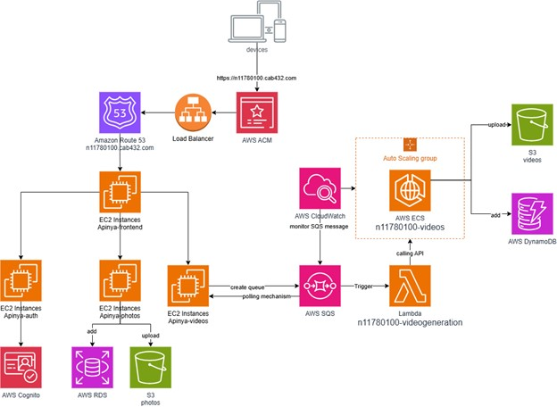

# Overview
This project is a cloud-native, microservices-based application designed for scalability, security, and modularity. 
It leverages AWS services to deliver high availability, secure content delivery, and seamless backend integration. 
The architecture includes secure HTTPS endpoints, private networking for internal microservice communication.

This project highlights:
- Effective use of AWS services for secure, scalable, and serverless architectures.
- Integration of load balancing, private networking, and HTTPS for production-grade deployments.
- A practical implementation of microservices and cloud-native principles.

# Key Features
- **Secure HTTPS Access**: Content is served through Amazon Route 53 and an Application Load Balancer (ALB) over port 443 with a valid AWS ACM SSL certificate.
- **Microservices Communication**: Internal communication between microservices is handled securely over a private network using port 80.
- **User Authentication**: Secure JWT-based authentication using AWS Cognito.
- **Photo Management**: Users can upload, store, and manage photos in Amazon S3 with metadata saved in AWS RDS.
- **Video Generation**: Generates custom videos from user-uploaded photos, leveraging AWS Lambda, AWS SQS, and FFmpeg.
- **Dynamic Content Management**: Lists user-specific videos using presigned URLs for secure and temporary access.
- **Scalability**: Designed with Amazon ECS for auto-scaling video processing workloads.
- **Monitoring and Logging**: Integrated Amazon CloudWatch for detailed logging and monitoring.

# Architecture
The application is built using a microservices architecture, where each service has a specific purpose:
- **Frontend**: Hosted on AWS EC2 together with backend (t2.micro)
- **Load Balancer**:
  - Application Load Balancer (ALB) ensures secure and balanced traffic distribution to backend services.
  - Exposes services over port 443 (HTTPS) while enabling internal microservices communication over port 80 in a private network.
- **Backend Services**:
  - **Auth Service**: Handles user authentication via AWS Cognito.
  - **Photo Service**: Manages photo uploads and stores metadata in RDS.
  - **Video Service**: Processes video generation and stores output in S3.
  - **app.js in Backend**: Provide as Core Application Service which provides routes requests from frontend to the services.
- **Data Layer**:
  - **Amazon RDS**: Stores user data and metadata for uploaded photos.
  - **Amazon DynamoDB**: Tracks video metadata and processing status.
- **Orchestration & Event Handling**:
  - **AWS SQS**: Queues video generation tasks.
  - **AWS Lambda**: Serverless function for processing intensive video rendering tasks.

# Tech Stack
- Backend: Node.js, Express.js, AWS SDK
- Frontend: React.js
- Cloud Services:
  - Route 53 (Domain name management for custom URLs)
  - ALB (Load balancing and HTTPS support)
  - ACM (SSL certificate management)
  - AWS Cognito (User Authentication)
  - Amazon S3 (Storage)
  - Amazon RDS (Relational Database)
  - Amazon DynamoDB (NoSQL Database)
  - Amazon ECS (Container Orchestration with auto-scaling)
  - AWS Lambda (Serverless Functions)
  - AWS SQS (Queue Management)
  - CloudWatch (Monitoring and Logging)
  - Media Processing: FFmpeg

# How it works
1. **HTTPS Access**:
  - The application domain is managed by Route 53 and served through an ALB over HTTPS (port 443).
  - Internal microservices communicate over a secure private network on port 80.
2. **User Workflow**:
  - Users sign up and log in securely via the Auth Service.
  - Authenticated users can upload photos (stored in S3) and request video creation.
3. **Video Processing Pipeline**:
  - A serverless pipeline processes photos into videos using AWS SQS, Lambda, and FFmpeg.
  - Generated videos are stored in S3, with metadata saved in DynamoDB for tracking.
4. **Scalability**:
  - Auto-scaling is enabled on ECS, ensuring efficient resource utilization during peak loads.
